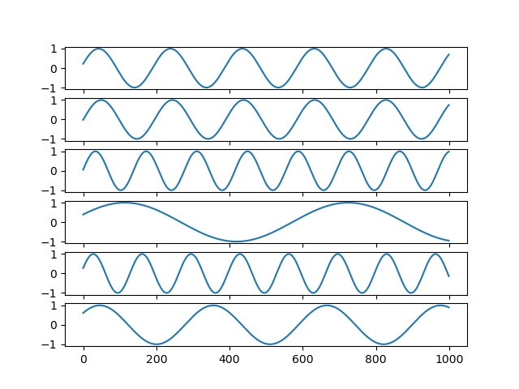
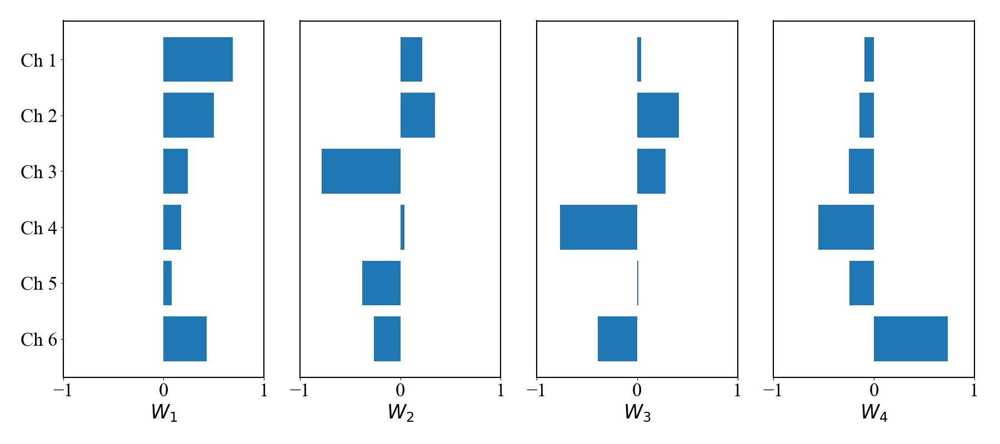
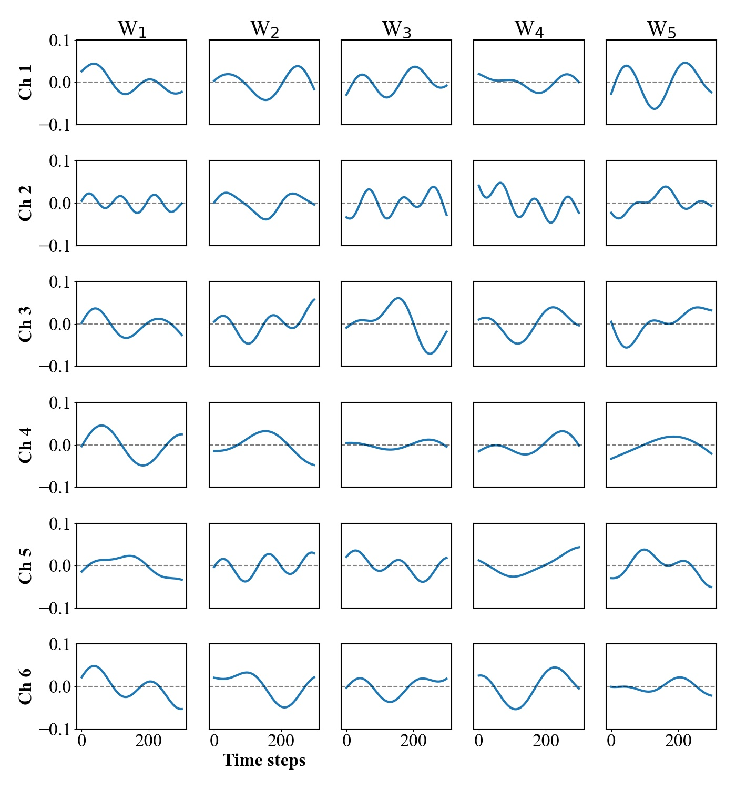
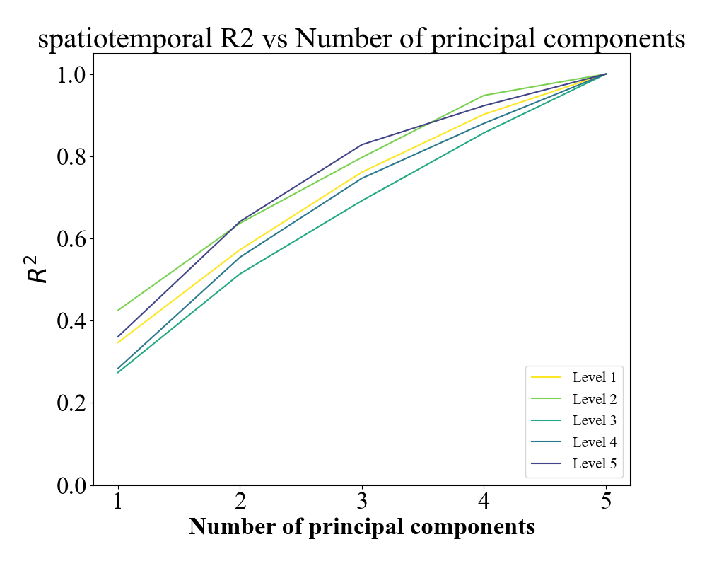
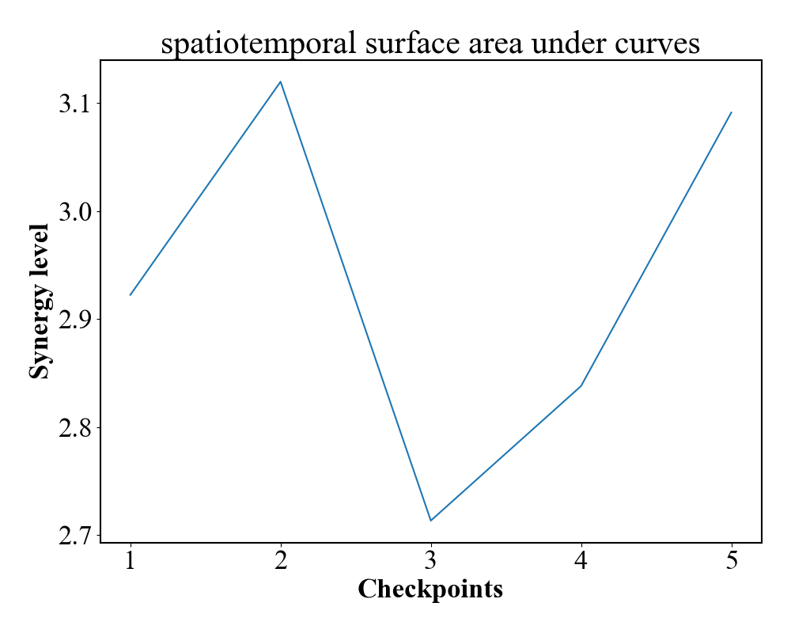

# synergyTool
Tool to calculate spatial and spatiotemporal synergy from given input data.


## Example Usage

```
python syntaticData.py # To create syntatic input data.
python main.py --synergy_type spatial
python main.py --synergy_type spatiotemporal 
```
## Available parameters


| Argument | Description | Default&nbsp;value | Type |
| -------- | ----------- | ------------------ | ---- |
| folder_path | Specify the path to the input data. | syntatic_data | str |
| output_folder_name | The folder name for output figures.  | output_figures | str |
| windows | The window size of the input signal to carry out PCA decompositions.| 300 | int |
| start_index | The starting time index of the input signal to be considered. Transient data before the start index is ignored. | 0 | int |
| synergy_type | To specify whether spatial or spatiotemporal synergy is calculated. | spatiotemporal | str |
| no_label |  To determine whether to put legends/labels on figures. | True | boolean |
| y_lim |  The limit of the Y-axis for the surface area plot. | None | float |


## Example Outputs
### 1) Example input syntatic data:


### 2) Example of spatial synergy:

   
### 3) Example of spatiotemporal synergy:

   
### 4) Example of spatiotemporal synergy evolution:

   
### 5) Example of surface area under spatiotemporal synergy development curves:

   

# References
The algorithms are based on the following paper:

J. Chai and M. Hayashibe, *"Motor Synergy Development in High-Performing Deep Reinforcement Learning Algorithms,"* in IEEE Robotics and Automation Letters, vol. 5, no. 2, pp. 1271-1278, April 2020, doi: 10.1109/LRA.2020.2968067.
